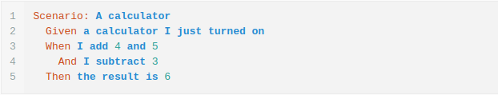
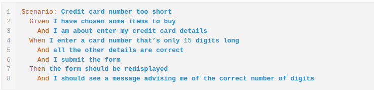
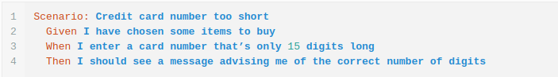
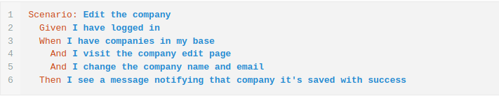
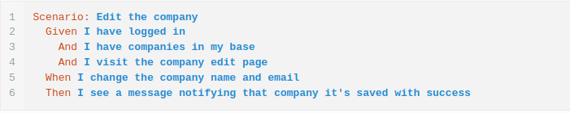

**Como escrever cenários melhores conhecendo anti-padrões de *Cucumber*** 

O *Cucumber* tem sido elencado por diversas empresas como pré-requisitos para vagas de QA. Pode se observar no LinkedIn mais 3000 vagas pelo mundo. Fica nítido que é um framework firmado e auxilia a ficar atualizado com o mercado. 

Ao escrever cenário ver o que está errado é uma ótima maneira de aprender. Neste post será compartilhado várias formas de escrever cenários melhores com os anti-padrões do Cucumber. 

**1.  Usar elementos da interface do usuário**

Importante utilizar elementos da interface do usuário como base para descrever o todo e qualquer cenário. Com uma busca no Google pode se achar muito exemplos com a mesma aproximação. 

Ao verificar o cenário abaixo, dever focar nas palavras chaves, que representam a interface do usuário: **usename, textbox, password textbox, click e button**.

 

 Nesse caso se esta interface do sistema for alterada no futuro, este será um problema e se terá o trabalho de refaze-la e atualizar a descrição de arquivo de feature e logo após no arquivo de ***step*** . 

Ao modificar a interface do sistema de forma que não altere o funcionamento do sistema e a descrição deve continuar igual se possível, as alterações devem ser feitas apenas no arquivo ***step*** . 

Dessa forma, para reescrever este cenário, basta escrever em um nível superior de abstração removendo ou substituindo as palavras que apontam a interface do usuário. 

 

  
É possível observar que o cenário ainda não está escrito em sua melhor performance, mas será corrigido apenas o ***anti-padrão*** por enquanto. 

 **2. Mais uma regra de negócio no mesmo cenário** 

Saber onde até vai o escopo ao elabora-lo é também outra dificuldade muito comum. Não deve ter mais de uma regra de negócio no mesmo cenário, uma vez que este seria um motivo para separa-la como no exemplo abaixo. 

 

Ao que parece, está tudo correto, mas está errado! Ao ler o cenário percebe se que está testando operações de adição e subtração ao mesmo tempo, logo se, a operação tiver algum problema, não será viável perceber se a subtração está funcionando. 

 

 
Separando os cenários devidamente, parte se do princípio de responsabilidade única, aumentando a confiabilidade e não deixando espaço para dúvidas. 

**3. Cenário como nomes ruins** 

Ao escolher o nome do cenário auxilia muito a entender o comportamento de uma determinada parte do sistema. Recordando que o Cucumber tem como principal função a chamada documentação viva, é necessário se preocupar em oferecer um nome expressivo para quem está lendo. 

Verificando o cenário abaixo como o nome  **Take out money whitout sucess**, sabe se que não foi possível retirar o dinheiro, mas o motivo só fica claro no ao ler o resultado esperado. 

 

Ao mudar o nome para **Requested amount greater than the balance** é mais simples de entender já no início qual será o comportamento que o cenário vai simular. 

 

Um fator que pode auxiliar bastante ao escolher o nome é faze-lo no final da descrição, assim pode se usar a ação (***When***)  ou o resultado esperado como base para o nome do cenário. 

**4. Descrever cenários como teste**

Muitas vezes tem se o hábito de escrever cenários passo a passo como se fosse um teste manual no sistema. Porém de acordo com que se evolui o conhecimento no framework, percebemos que o mais importante do cenário é o que ele pretende validar e não como vai validar. 

 

Observando o cenário é possível verificar que ele está com muito detalhes não importantes, os quais não cooperam para a validação da regra do negócio. 

A informação sobre inserir o formulário deve ficar implícitas na descrição e se possível será parte na construção do ***step*** . 

 

Ao excluir os detalhes que não cooperam para a documentação temos um cenário mais objetivo. 

**5. Confusão com as palavras reservadas Given, When e Then**

Embora o Cucumber não faça distinção entre as palavras reservadas ***Given, When e  Then*** usa-las nos cenários facilita a leitura. Entretanto, com frequência pode encontrar palavras que foram usadas de forma incorreta. 

Antes de usar exemplo com essa situação, é importante relembrar o conceito. 

***Given*** deve ser usado como contexto e massa de dados, o ***When*** ser refere a ação ou evento e o ***Then*** tem relação ao resultado esperado. 

Pode se levar em conta que o ***Given*** é como o passado, o ***When*** como presente e o ***Then*** como um futuro próximo. 

No exemplo deste cenário o ***When***  está aplicado no passo certo, uma vez que ter uma empresa base e visitar a página da empresa são pré-condições (***Given***) para fazer a ação de alterar o nome e e-mail da empresa. 

 

Depois da alteração tem se um cenário mais legível onde a ação mais importante do cenário começa com a palavra reservada ***When***. 

**Conclusão** 

Se em algum momento desses erros pode se observar erro, é possível dizer que o caminho está correto. Deslizes são cometidos a todo tempo e aprende se muito com eles. Construir cenários como documentação é uma iniciativa desafiadora onde a melhor forma de aprender é praticando. 

 